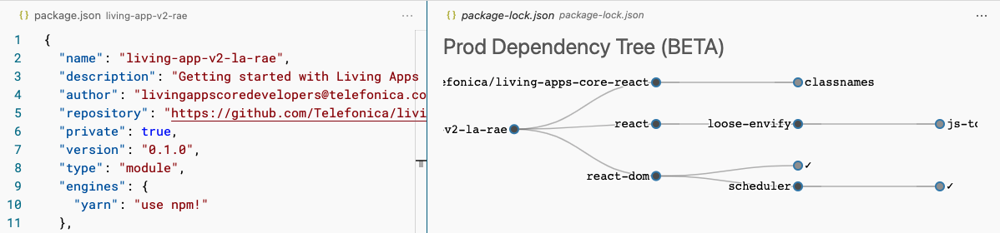

# `lock-tree` [[BETA]]

> **Visualize the `package.-lock.json` Dependency Tree**

## Features

`package-lock.json` has a ton of information. But it's not designed to be read by humans. 
This extension allows you to visualize the dependency tree defined at `package-lock.json` making it easier to understand.

## TODO [[BETA]]

- [] Feature: `onClick` - collapse or extend node/tree
- [] Feature: vsCode - Instead of open .json file right away, create a `Split View`
- [] Visual: fix - node text is cut off
- [] visual: improve node & hover styles
- [] Feature: search (filter the resolving tree)

## Nice to have's

- [] Feature: Instead of ✓, link the node to the existing node (graph)
- [] Feature: enable dev dependencies

## Extension Settings

None

---

## Release Notes

### 0.0.1

Beta Initial release...
